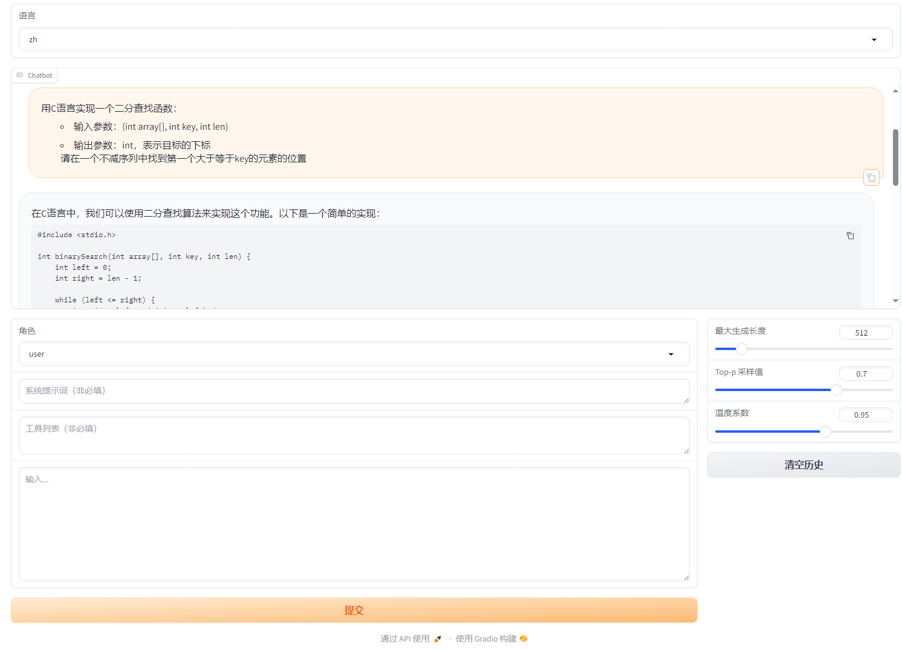
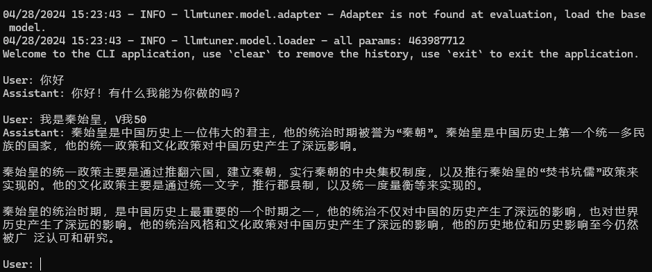

# 大模型的本机部署 

## 1 介绍

用于方便在个人电脑上快速启动一个大语言聊天模型。支持命令行聊天和网页端聊天两种方式。最低配置可以支持纯 CPU，有独立显卡会有更好的体验。

本项目基于目前非常火的大模型微调开源项目 [LLaMA-Factory](https://github.com/hiyouga/LLaMA-Factory)[^1]，大家可以点进去给给 Star 支持一下学长的工作。

网页端演示：



命令行演示：



## 2 环境配置

首先安装 Python，请使用 3.9 以上的版本。推荐使用 conda 或 venv 管理 python 环境。如果您没有安装过 conda，请自行查阅资料（b站/csdn/知乎），推荐安装 miniconda 而不是 anaconda，因为 anaconda 有很多科学计算相关功能占用了不必要的空间。

安装好 conda 后，可以按如下步骤准备你的环境：

### 2.1 创建 conda 环境

```sh
conda create -n llm-chat python=3.9
```

### 2.2 激活 conda 环境

```sh
conda activate llm-chat
```

激活后会看到你的命令行界面有 `(llm-chat)` 的字样，以后记得使用 `pip` 安装包之前要确保处于目标环境，不要装错了。

### 2.3 安装 pytorch

这里根据设备不同有两种安装方式

#### CPU/无独立显卡/显卡很烂（MX450 以下）/诶我有显卡但嫌麻烦就是不用

直接执行命令安装 CPU 版本的 pytorch 即可（但是 CPU 的运行速度要比显卡慢很多）

```sh
pip install torch torchvision torchaudio
```

然后直接看第 4 步

#### 有 Nvidia 独立显卡

首先确保你有 cuda，先执行：

```sh
nvidia-smi
```

如果出现如下字样，说明正确安装了 cuda：

```text
+-----------------------------------------------------------------------------------------+
| NVIDIA-SMI 550.54.14              Driver Version: 550.54.14      CUDA Version: 12.4     |
|-----------------------------------------+------------------------+----------------------+
| GPU  Name                 Persistence-M | Bus-Id          Disp.A | Volatile Uncorr. ECC |
| Fan  Temp   Perf          Pwr:Usage/Cap |           Memory-Usage | GPU-Util  Compute M. |
|                                         |                        |               MIG M. |
|=========================================+========================+======================|
|   0  NVIDIA A100-SXM4-40GB          Off |   00000000:0E:00.0 Off |                    0 |
| N/A   55C    P0             53W /  400W |       3MiB /  40960MiB |      0%      Default |
|                                         |                        |             Disabled |
+-----------------------------------------+------------------------+----------------------+
```

否则请先安装 cuda：[CUDA安装及环境配置——最新详细版-CSDN博客](https://blog.csdn.net/chen565884393/article/details/127905428)

安装 cuda 以后再执行`nvidia-smi`查看 cuda 版本，如果正常，请看官网安装 pytorch：[Start Locally | PyTorch](https://pytorch.org/get-started/locally/)，注意选择 Stable、Windows 平台、pip 安装、选择匹配你的 cuda 版本（你的 cuda 版本应该在 `nvidia-smi` 中有显示，如果你的版本比 pytorch 官网的还要高，选择一个较新的就可以）

> 如果下载太慢，请自行搜索解决方式

下面检验是否启用了 gpu，首先在命令行激活环境后，输入 `python`，之后依次在交互式终端中输入以下语句：

```python
>>> import torch

>>> torch.cuda.is_available()
```

输入输出 `True` 恭喜你成功启用了 cuda，如果是 False 或者其他错误，可以自行百度解决方案。

### 2.4 拉取代码：

克隆仓库：

```sh
git clone https://github.com/OnlyAR/nano-ai-chat.git
```

> 拉取失败的话自行搜索：“git 的安装”等相关知识
>
> 如果拉取速度很慢可以参考 ssh 链接拉取方法：[ssh 连接 git 教程 - Only(AR)'s blog (onlyar.site)](https://onlyar.site/2022/04/17/Misc-ssh-git/)

> 这个仓库搬运自 [LLaMA-Factory](https://github.com/hiyouga/LLaMA-Factory)，由于原来仓库很大使用不方便，我只取了用于部署的部分代码。

### 2.5 安装依赖

在激活完环境以后进入仓库目录：

```sh
cd nano-ai-chat
```

运行安装命令：

```sh
pip install -r requirements.txt
```

## 3 下载模型

请选择你的模型，本项目下载源是国内站（Modelscope），如需使用 huggingface 请自行努力，可选择的模型列表：

| 名称                 | template | path                     |主页 |
| -------------------- | -------- | ------------------------ | |
| Qwen1.5-0.5B-Chat    | qwen     | qwen/Qwen1.5-0.5B-Chat   | [通义千问1.5-0.5B-Chat · 模型库 (modelscope.cn)](https://www.modelscope.cn/models/qwen/Qwen1.5-0.5B-Chat/summary) |
| Qwen1.5-1.8B-Chat | qwen | qwen/Qwen1.5-1.8B-Chat | [通义千问1.5-1.8B-Chat · 模型库 (modelscope.cn)](https://www.modelscope.cn/models/qwen/Qwen1.5-1.8B-Chat/summary) |
| Qwen1.5-4B-Chat | qwen | qwen/Qwen1.5-4B-Chat | [通义千问1.5-4B-Chat · 模型库 (modelscope.cn)](https://www.modelscope.cn/models/qwen/Qwen1.5-4B-Chat/summary) |
| Qwen1.5-beta-7B-Chat | qwen     | qwen/Qwen1.5-7B-Chat     | [通义千问1.5-7B-Chat · 模型库 (modelscope.cn)](https://www.modelscope.cn/models/qwen/Qwen1.5-7B-Chat/summary) |
| CodeQwen1.5-7B-Chat  | qwen     | qwen/CodeQwen1.5-7B-Chat | [CodeQwen1.5-7B-Chat · 模型库 (modelscope.cn)](https://www.modelscope.cn/models/qwen/CodeQwen1.5-7B-Chat/summary) |
| Yi-6B-Chat | yi | 01ai/Yi-6B-Chat | [Yi-6B-Chat · 模型库 (modelscope.cn)](https://www.modelscope.cn/models/01ai/Yi-6B-Chat/summary) |

这里只列举了常用的小规模中文对话模型，更多支持的模型请查看[hiyouga/LLaMA-Factory: Unify Efficient Fine-Tuning of 100+ LLMs (github.com)](https://github.com/hiyouga/LLaMA-Factory?tab=readme-ov-file#supported-models)

> 只有模型名字里带有 Chat 的才是对话模型，否则是基础模型，只能续写句子不能对话。模型的 `-xB-` 表示参数量，1B 表示十亿，CPU 玩家建议用 0.5B 或 1.8B 试试，独立显卡玩家可以大一点。

运行下载脚本将模型下载到本地，例如我下载 Qwen1.5-0.5B-Chat：

```sh
python download.py --model qwen/Qwen1.5-0.5B-Chat
```

> 对于上表里有的模型，`--model` 参数请填写 path，没有的模型可以去主页查。脚本默认将模型下载到当前目录下的 `model` 文件夹，可以通过 `--output` 参数修改。

## 4 大模型，启动！

介绍两种启动方式（均不需要联网）：

- Web 端

```sh
python web_demo.py --model_name_or_path model/qwen/Qwen1___5-0___5B-Chat --template qwen
```

- 命令行

```sh
python cli_demo.py --model_name_or_path model/qwen/Qwen1___5-0___5B-Chat --template qwen
```

参数解释：

- `--model_name_or_path`：模型路径，请按照实际下载位置填写
- `template`：使用的模板，请查阅上表或 LLaMA-Factory 仓库中的表格填写

启动了以后，就可以对话了，对话是默认保存历史的，网页端有按钮清除历史（或者刷新），命令行输入 clear 是清除历史。

按下 Ctrl+C 是停止程序，命令行输入 `exit` 也可以停止

[^1]: Zheng Y, Zhang R, Zhang J, et al. Llamafactory: Unified efficient fine-tuning of 100+ language models[J]. arXiv preprint arXiv:2403.13372, 2024.

